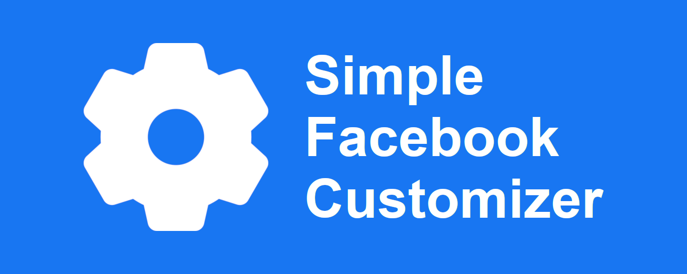

# 

Simple Facebook Customizer is an extension for Chromium-based browsers (Google Chrome, Microsoft Edge, Brave and more). It's main purpose is to change default Facebook look with any combination of either custom defined or predefined settings.

Hiding various bars, notifications, messages and more! Remove elements that bother you, or you simply don't like the look of them.

Need was the mother of this extension - installing an extension and simply checking wanted toggles is way easier than editing browser custom CSS's every time you want to make persistent stylesheet for a website - in this case Facebook.

Feedback highly appreciated, ideas or requests for any features will be taken into account and maybe implemented in the near future.

## Build project locally
To build project locally you shall clone the repository and run **`npm run watch`** to watch for changes. Next when you've made the changes that you want run **`npm run build`** to build the project once again and bundle it into a ZIP archive that is a valid upload format of an extensions to Chrome Web Store.

## Contributing
Contribution in any shape or form is welcome, feel free to submit a pull request with any change that you think would make an extension better. Right now we are mostly looking for a new settings options.
